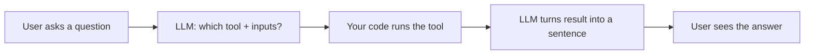

# How Does an AI Actually "Use Tools"? I Built It From Scratch to Find Out

*A beginner-friendly, story-style walkthrough of LLM tool calling — using a free, local, open-source model and ~150 lines of Python.*

---

## The question that started it all

I kept hearing phrases like *"the AI called a tool,"* *"function calling,"* and *"agents."*

ChatGPT can browse. Copilot can run code. Agents can book flights. But **how does the AI actually know when to reach for a calculator instead of a database?** And once it "decides," who actually *runs* the thing?

I didn't want another diagram. I wanted to **build the smallest possible real version** and watch it work.

So I did. No frameworks. No paid API. No magic. Just an open-source model running on my laptop and four plain Python functions.

Here's the whole story.

---

## The one idea that makes it click

Before any code, here's the mental model that changed everything for me:

> **The LLM is a brain that decides. It has no hands.**
> Your code is the hands. "Tool calling" is just the LLM saying *"use this tool with these inputs"* — and your program actually doing it.

That's it. The model never runs your calculator. It only *says* "you should run the calculator with 45 and 5." Your code does the rest.

Keep that picture in your head. Everything below is just plumbing around it.



---

## Step 1: A free brain on my own laptop

I didn't want API keys or bills. So I ran an open-source model locally using **Ollama** inside **Docker**. One file does it:

```yaml
# docker-compose.yml
services:
  ollama:
    image: ollama/ollama:latest
    container_name: delegation-ollama
    ports:
      - "11434:11434"
    volumes:
      - ollama-data:/root/.ollama
    healthcheck:
      test: ["CMD", "ollama", "list"]
      interval: 15s
      timeout: 10s
      retries: 20
      start_period: 20s

  ollama-init:
    image: ollama/ollama:latest
    depends_on:
      ollama:
        condition: service_healthy
    environment:
      OLLAMA_HOST: http://ollama:11434
    command: ["pull", "llama3.2:3b"]
    restart: "no"

volumes:
  ollama-data:
```

Two commands and I had a working LLM:

```bash
docker compose up -d ollama
docker compose run --rm ollama-init   # downloads llama3.2:3b (~2 GB)
```

I picked **`llama3.2:3b`** — a small 3-billion-parameter model. Tiny enough to run on a normal laptop, and (spoiler) just dumb enough to teach me an important lesson later.

---

## Step 2: Giving the AI some real hands (tools)

A "tool" is nothing fancy — it's just a function that returns real data. I wrote four:

```python
# tools.py

# TOOL 1 — Calculator
def calculator(operation: str, a: float, b: float) -> dict:
    if operation == "add":
        result = a + b
    elif operation == "subtract":
        result = a - b
    elif operation == "multiply":
        result = a * b
    elif operation == "divide":
        if b == 0:
            return {"error": "Division by zero"}
        result = a / b
    else:
        return {"error": f"Unknown operation: {operation}"}
    return {"operation": operation, "a": a, "b": b, "result": result}


# TOOL 2 — Database lookup (fake but real-feeling data)
USER_DATABASE = {
    "user_001": {"name": "Alice Johnson", "email": "alice@example.com", "balance": 5420.50},
    "user_002": {"name": "Bob Smith",     "email": "bob@example.com",   "balance": 3210.00},
}

def database_query(user_id: str) -> dict:
    if user_id in USER_DATABASE:
        return {"found": True, "user_id": user_id, **USER_DATABASE[user_id]}
    return {"found": False, "error": f"User {user_id} not found"}


# TOOL 3 — Weather
WEATHER_DATA = {
    "london": {"temp": 59, "condition": "Rainy",  "humidity": 85},
    "tokyo":  {"temp": 81, "condition": "Humid",  "humidity": 75},
}

def weather_lookup(city: str) -> dict:
    data = WEATHER_DATA.get(city.lower())
    if data:
        return {"found": True, "city": city, **data, "unit": "Fahrenheit"}
    return {"found": False, "error": f"No weather for {city}"}


# TOOL 4 — Clock
from datetime import datetime

def get_current_time() -> dict:
    now = datetime.now()
    return {"date": now.strftime("%Y-%m-%d"), "time": now.strftime("%H:%M:%S"), "day": now.strftime("%A")}
```

Then I put them in a simple **registry** so the rest of the code can find them by name:

```python
TOOLS = {
    "calculator":      {"description": "Do math (add, subtract, multiply, divide)", "func": calculator},
    "database_query":  {"description": "Look up a user by user_id",                 "func": database_query},
    "weather_lookup":  {"description": "Get weather for a city",                    "func": weather_lookup},
    "get_current_time":{"description": "Get the current date and time",             "func": get_current_time},
}

def execute_tool(tool_name: str, **kwargs) -> dict:
    return TOOLS[tool_name]["func"](**kwargs)
```

That registry is important: it's also the **menu** we'll hand to the AI so it knows what's available.

---

## Step 3: Teaching the AI to choose

Here's the heart of it. We send the model the list of tools and the user's question, and we ask it to reply with a **tiny JSON** instead of prose:

```python
def build_tool_prompt(user_query: str) -> str:
    tool_descriptions = "\n".join(
        f"- {t['name']}: {t['description']}" for t in TOOLS.values()
    )
    return f"""You are a helpful assistant with access to these tools:

{tool_descriptions}

USER QUERY: {user_query}

Respond with ONLY a JSON object in this format:
{{"tool": "tool_name", "params": {{"param1": value1}}}}

Examples:
- "What is 15 times 8?" -> {{"tool": "calculator", "params": {{"operation": "multiply", "a": 15, "b": 8}}}}
- "Tell me about user_002" -> {{"tool": "database_query", "params": {{"user_id": "user_002"}}}}
- "Weather in Paris?" -> {{"tool": "weather_lookup", "params": {{"city": "Paris"}}}}
"""
```

When I ask *"What is 45 divided by 5?"*, the model replies with exactly this:

```json
{"tool": "calculator", "params": {"operation": "divide", "a": 45, "b": 5}}
```

**That's the famous "tool call."** It's not running anything. It's just a structured suggestion. Our code reads it and acts.

---

## Step 4: The full loop (4 simple moves)

The whole orchestration is four moves:

```python
def process_query(user_query: str) -> dict:
    # 1) Ask the LLM which tool to use
    llm_response = call_llm(build_tool_prompt(user_query))

    # 2) Parse the JSON it returned
    decision = parse_tool_call(llm_response)   # {"tool": ..., "params": {...}}

    # 3) WE run the chosen tool (the model never does this)
    result = execute_tool(decision["tool"], **decision["params"])

    # 4) Ask the LLM to turn raw data into a friendly sentence
    final = call_llm(f"User asked: {user_query}\nTool result: {result}\nAnswer briefly.")
    return final
```

Run it, and you literally watch the decision happen:

```
USER QUERY: What's the weather in Tokyo?

[1] Sending to LLM: "Which tool should I use?"
[2] LLM Response: {"tool": "weather_lookup", "params": {"city": "Tokyo"}}
[3] Executing Tool: weather_lookup({"city": "Tokyo"})
[4] Result: {"found": true, "city": "Tokyo", "temp": 81, "condition": "Humid"}
[5] Final Answer: It's currently humid in Tokyo at around 81°F.
```

The brain decided. The hands executed. The brain explained.

---

## Step 5: The bug that taught me the most

Here's where theory met reality.

When I asked *"What time is it right now?"*, my small 3B model **ignored the tools entirely** and tried to answer from memory:

```json
{"tool": null, "answer": "The current time is not available."}
```

Wrong! It had a perfectly good `get_current_time` tool and just... forgot to use it.

Big models rarely do this. Small ones do it constantly. So I added a **safety net** — a tiny rule-based fallback that catches obvious cases the model fumbles:

```python
def fallback_tool_decision(user_query: str) -> dict:
    q = user_query.lower()

    # "user_001" style IDs -> database
    user_match = re.search(r"\buser_\d{3}\b", q)
    if user_match:
        return {"tool": "database_query", "params": {"user_id": user_match.group(0)}}

    # time / date / day -> clock
    if any(w in q for w in ["time", "date", "day"]):
        return {"tool": "get_current_time", "params": {}}

    # "weather in <city>" -> weather
    m = re.search(r"weather in ([a-z\s]+)", q)
    if m:
        return {"tool": "weather_lookup", "params": {"city": m.group(1).strip().title()}}

    return {"tool": None}
```

And I wired it in: *if the model didn't pick a tool, try the fallback before giving up.*

```python
decision = parse_tool_call(llm_response)
if not decision.get("tool"):
    fallback = fallback_tool_decision(user_query)
    if fallback.get("tool"):
        decision = fallback   # safety net saved us
```

After that, *"What time is it?"* worked every time.

**The lesson:** real AI systems aren't just "ask the model and trust it." They're **the model plus guardrails**. That fallback is a miniature version of what every production agent has.

---

## Step 6: Making it a live demo

Finally, I added an interactive chat loop so I could just type and watch:

```python
def run_interactive():
    while True:
        q = input("\nYou> ").strip()
        if q in {"/quit", "/exit"}:
            break
        result = process_query(q)
        print("Assistant>", result["final_answer"])
```

Now I run:

```bash
python main.py
```

…and type anything:

```
You> Tell me about user_001
Assistant> user_001 is Alice Johnson (alice@example.com) with a balance of $5,420.50.

You> What is 100 plus 250?
Assistant> The sum of 100 and 250 is 350.
```

Watching the model pick a different tool for each question — live — is the moment it all *clicks*.

---

## What I actually learned

1. **Tool calling is not mysterious.** The model outputs structured text saying *what* to do. Your code does it.
2. **The LLM has no hands.** It decides; your program executes. Always.
3. **Small models need guardrails.** A few lines of fallback logic turned a flaky demo into a reliable one — and that's exactly what real agents do at scale.
4. **You don't need a framework to understand the core.** ~150 lines and a free local model are enough.

Everything LangChain, the OpenAI "tools" API, or a full agent does is a more powerful version of these same four moves: **describe tools → model picks one → you run it → model explains the result.**

---

## Try it yourself

The whole thing is just three files:

- `docker-compose.yml` — spins up the free local model
- `tools.py` — the four functions (the "hands")
- `main.py` — the decision loop (the "brain wiring")

```bash
docker compose up -d ollama
docker compose run --rm ollama-init
python main.py
```

Then type a question and watch the AI reach for the right tool.

---

*If this helped demystify tool calling for you, I'd love to hear which part finally made it click. That's the whole reason I wrote it down.*
