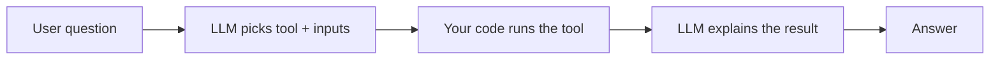

# How an LLM Actually "Uses Tools" — Built From Scratch

A tiny, real demonstration of **LLM tool calling** using a free, local, open-source model (Ollama + `llama3.2:3b`) and ~150 lines of Python.

No frameworks. No API keys. No magic.

> **The core idea:** The LLM is a brain that *decides*. It has no hands.
> Your code is the hands. Tool calling = the model says *"use this tool with these inputs"*, and your program runs it.



## Reproduce in 3 commands

```bash
docker compose up -d ollama          # 1. start the local model server
docker compose run --rm ollama-init  # 2. download llama3.2:3b (~2 GB, one time)
python main.py                       # 3. chat and watch it pick tools live
```

Requires Docker + Python (`pip install -r requirements.txt`).

No Docker? Install [Ollama](https://ollama.ai) directly, then:
```bash
ollama pull llama3.2:3b
python main.py
```

## What's inside

| File | Role |
|------|------|
| [tools.py](tools.py) | The 4 tools (the "hands"): calculator, database lookup, weather, clock |
| [main.py](main.py) | The decision loop (the "brain wiring") + interactive chat |
| [docker-compose.yml](docker-compose.yml) | Spins up the free local LLM |

## How it works (4 moves)

1. Show the LLM the tool menu + the user's question
2. LLM replies with tiny JSON: `{"tool": "calculator", "params": {"operation": "divide", "a": 45, "b": 5}}`
3. **Your code** runs that tool
4. LLM turns the raw result into a friendly sentence

## Two ways to run

```bash
python main.py              # interactive chat (type your own questions)
python main.py --mode demo  # fixed demo prompts, runs all tools once
```

Interactive commands: `/help`, `/examples`, `/quit`

## Try these prompts

- `What is 81 divided by 9?` → calculator
- `Tell me about user_002` → database_query
- `What's the weather in London?` → weather_lookup
- `What time is it right now?` → get_current_time

## The lesson worth sharing

Small models sometimes **forget to use a tool**. This project includes a deterministic
**fallback router** in [main.py](main.py) that catches obvious cases the model fumbles
(user IDs, time, weather, simple math). That guardrail is a miniature version of what
every production AI agent does: **model + guardrails**, not "trust the model blindly."

## Add your own tool

1. Write a function in [tools.py](tools.py) that returns a `dict`
2. Register it in the `TOOLS` dict with a clear `description`
3. That's it — the LLM can now choose it

## Read the full story

📖 **[How Does an AI Actually "Use Tools"? I Built It From Scratch to Find Out](https://medium.com/ai-generative/how-does-an-ai-actually-use-tools-i-built-it-from-scratch-to-find-out-ab1377544ddc?sk=46c56f80996ecbe77aaac16b4c23f6d3)** — the full beginner-friendly walkthrough on Medium.

The same article is included in this repo: [ARTICLE.md](ARTICLE.md).

## Customize the model

- Copy `.env.example` to `.env`
- Set `OLLAMA_MODEL` to any Ollama model you prefer
